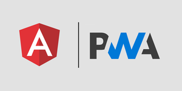

# Poc Pwa

Preview: [Acesse o Preview da POC de PWA](https://laughing-banach-31f778.netlify.app/)

  - Poc com intuíto de auxiliar no aprendizado referente a união de pwa + angular 9.
  - [Este projeto](https://github.com/GustavoCaspirro/poc-pwa) está em meu reposítorio particular no Github.

## Já implementado!

  - [Manifesto](https://developer.mozilla.org/en-US/docs/Web/Manifest), arquivo de configuração em json nomeado no projeto de manifest.webmanifest.
  - [Service Worker](https://developer.mozilla.org/en-US/docs/Web/API/Service_Worker_API), arquivo nomeado no projeto de ngsw-config.json.

Links complementares:
  - [Documentação Angular - PWA](https://angular.io/guide/service-worker-getting-started)

## Autor
* **Gustavo Caspirro** - [Github Pessoal](https://github.com/GustavoCaspirro)
